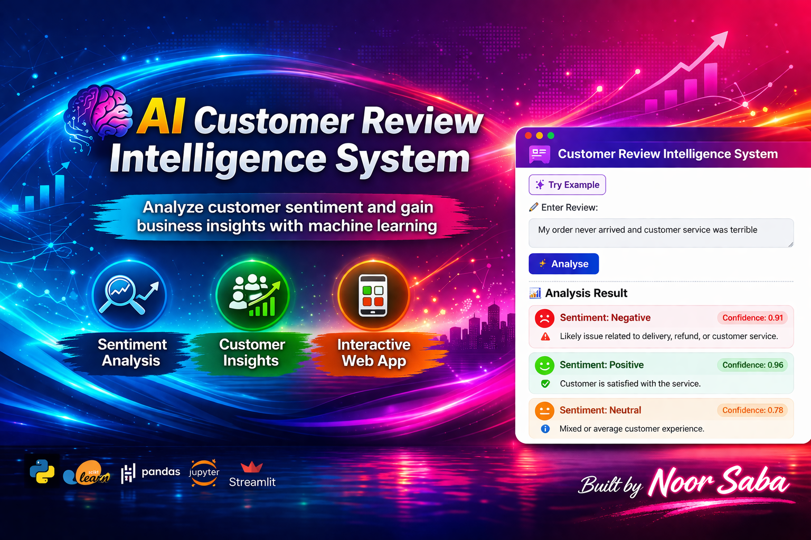

<p align="center">
  
</p>

# AI Customer Review Intelligence System

🚀 Analyse customer sentiment instantly using AI, NLP, and Machine Learning.

---

## 🌐 Live Demo

👉 [Open the app](https://ai-customer-review-intelligence-system-uazpvxzdz6rvisswxykork.streamlit.app/)
---

## Overview

This project builds an **AI-powered customer review intelligence system** that transforms raw customer feedback into actionable business insights.

The system combines:
- Natural Language Processing (NLP)
- Machine Learning (Logistic Regression)
- Unsupervised Learning (KMeans Clustering)
- Interactive Web App (Streamlit)

---

## Key Features

- 🔍 **Sentiment Analysis** (Positive / Neutral / Negative)
- 🧠 **NLP Processing** using TF-IDF
- 📊 **Customer Insight Discovery** using clustering
- ⚖️ **Class imbalance handling**
- 📈 **Confidence score prediction**
- 💡 **Business insight generation**
- 🌐 **Interactive Streamlit Web App**

---

## Dataset

- Real-world customer reviews dataset (~21,000 records)
- Includes:
  - Review Text
  - Rating
  - Country
  - Date

### Sentiment Mapping:
| Rating | Sentiment |
|--------|----------|
| 1–2    | Negative |
| 3      | Neutral  |
| 4–5    | Positive |

---

## Tech Stack

- Python  
- pandas, numpy  
- scikit-learn  
- matplotlib  
- NLP (TF-IDF)  
- KMeans Clustering  
- Streamlit  

---

## Machine Learning Pipeline

### 1. Data Preprocessing
- Text cleaning (lowercase, punctuation removal, etc.)
- Missing value handling
- Feature engineering

### 2. Feature Engineering
- TF-IDF Vectorization (unigrams + bigrams)

### 3. Model Training
- Logistic Regression
- Class weighting for imbalance handling

### 4. Model Evaluation
- Accuracy
- Precision, Recall, F1-score
- Confusion Matrix

---

## Results

- Achieved strong accuracy (~85–90%)
- Improved performance using class balancing
- Successfully identified customer dissatisfaction patterns

---

## Clustering Insights

KMeans clustering identified major complaint themes:

- 💳 Payment & Billing Issues  
- 🚚 Delivery & Logistics Problems  
- 🔁 Refund & Order Issues  
- 📞 Customer Service Complaints  
- 😡 General Dissatisfaction  

---

## Business Impact

This system enables businesses to:

- Identify key customer pain points  
- Improve delivery and operations  
- Enhance customer support  
- Reduce complaints and churn  
- Make data-driven decisions  

---

## Future Enhancements

- 🔗 LangChain integration for automated insights  
- 🤖 LLM-powered review summarisation  
- 🌍 Real-time deployment with API  
- 📊 Dashboard analytics  

---

## How to Run Locally

### 1. Install dependencies
```bash
pip install -r requirements.txt